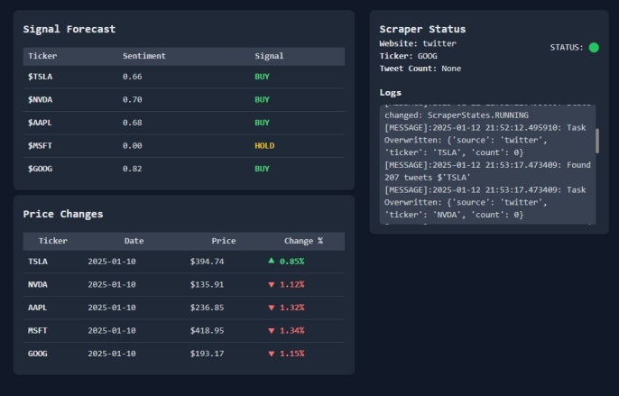
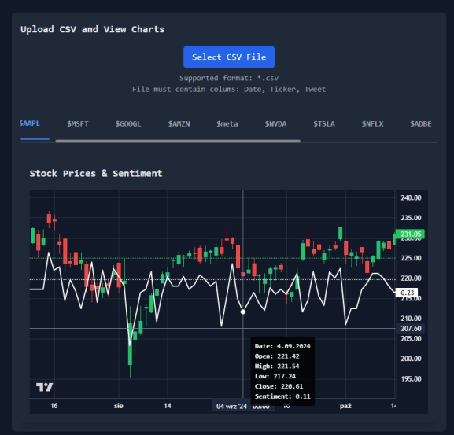
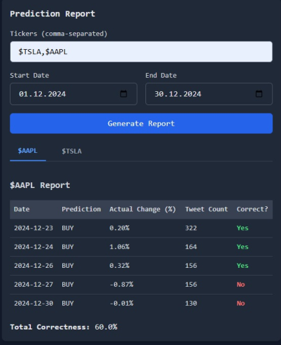

# Sentiment Analysis Application

An application that automatically analyzes real-time sentiment from X.com using AI models and also supports historical data analysis, report generation, chart visualization, and data collection management.

## Features

- **Real-Time Sentiment Analysis**: Automatically analyze sentiment from X.com in real-time using advanced AI models.
- **Historical Data Analysis**: Support for analyzing historical data to identify trends and patterns.
- **Report Generation**: Generate detailed reports on sentiment analysis and stock predictions.
- **Chart Visualization**: Visualize stock prices and sentiment data with interactive charts.
- **Data Collection Management**: Manage and configure data collection processes efficiently.

## Screenshots

### Signal Forecast and Scraper Status

### Upload CSV and View Charts

### Prediction Report

## Getting Started

1. Clone the repository.
2. Install the required dependencies.
3. Configure the application settings.
4. Run the application.

## License

This project is licensed under the MIT License.
