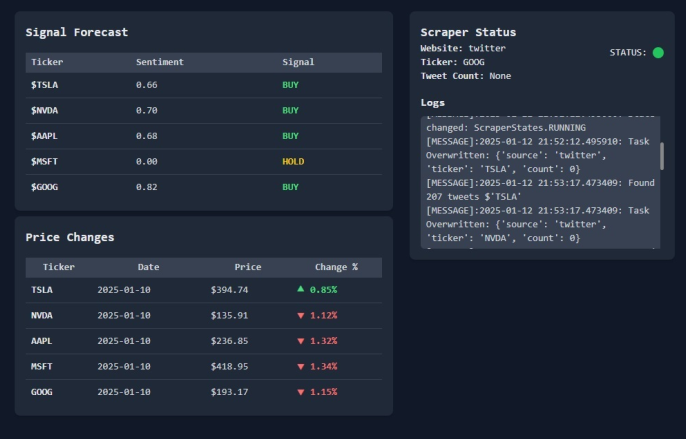
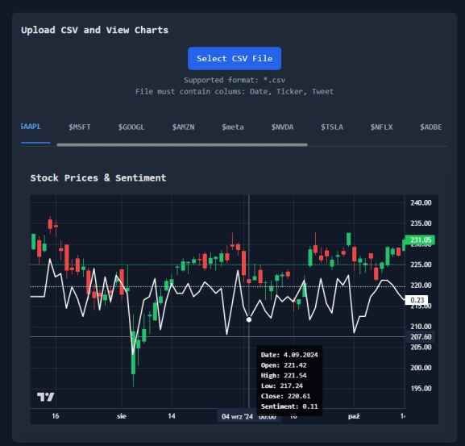
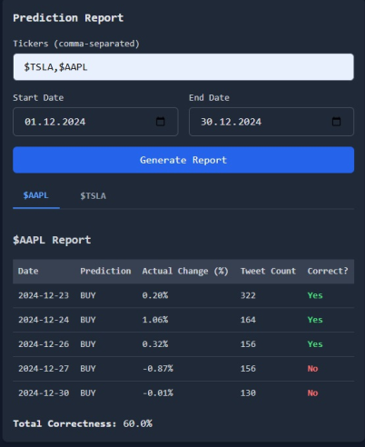

# Sentiment Analysis Application  

An application for **predicting market sentiment** by automatically analyzing posts from **X.com** using **Large Language Models (LLMs)**.  

## Goal  
The main goal of the system is to **identify and forecast market sentiment**, helping investors make better-informed trading decisions.  

## Features  
- **Real-Time Sentiment Analysis** – analyze sentiment from X in real time using LLMs.  
- **Historical Data Analysis** – explore trends and patterns in past data.  
- **Report Generation** – generate detailed reports on sentiment and stock predictions.  
- **Chart Visualization** – interactive charts for prices and sentiment data.  
- **Data Collection Management** – manage and configure data collection processes.  

## Tech Stack  
- **Backend**: Django, Redis, PostgreSQL  
- **AI/ML**: PyTorch, NLTK, Hugging Face Transformers  
- **Frontend**: Next.js  

## Screenshots  

### Signal Forecast and Scraper Status  
  

### Upload CSV and View Charts  
  

### Prediction Report  
  
