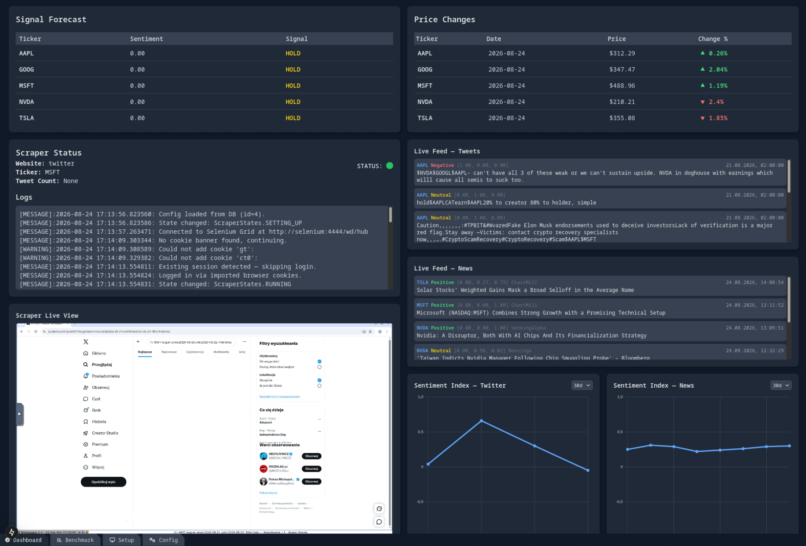
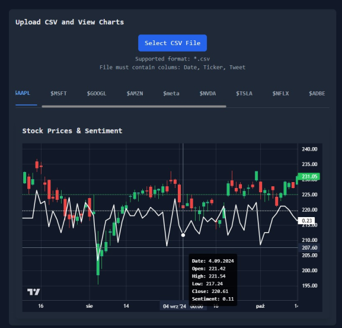
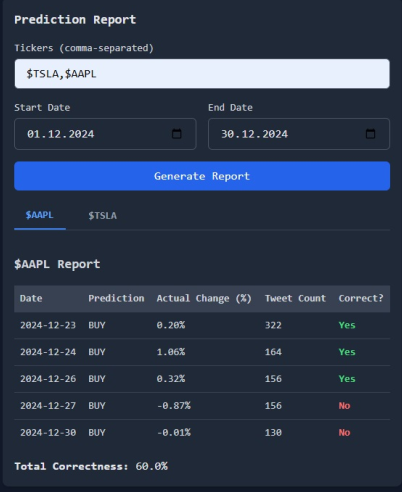

# Sentiment Analysis Application  

An application for **predicting market sentiment** by automatically analyzing posts from **X.com** using **Large Language Models (LLMs)**.  

## Goal  
The main goal of the system is to **identify and forecast market sentiment**, helping investors make better-informed trading decisions.  

## Features  
- **Real-Time Sentiment Analysis** – analyze sentiment from X in real time using LLMs.  
- **Historical Data Analysis** – explore trends and patterns in past data.  
- **Report Generation** – generate detailed reports on sentiment and stock predictions.  
- **Chart Visualization** – interactive charts for prices and sentiment data.  
- **Data Collection Management** – manage and configure data collection processes.  
- **Live & Historical Scraping Modes** – switch between a fast-polling mode that only pulls fresh posts (with DB-level dedup) and a mode that sweeps historical date ranges.  
- **Multi-Source News Ingestion** – pulls financial news from Finnhub alongside X.com, scored through FinBERT into a unified sentiment index.  
- **Resilient Background Processing** – async job queue with automatic retries and dead-letter handling, so a single failed prediction never blocks the pipeline.  

## Tech Stack  
- **Backend**: Django, Redis, Redis Queue (RQ), PostgreSQL  
- **AI/ML**: PyTorch, NLTK, Hugging Face Transformers  
- **Frontend**: Next.js  

**Production Ready** – Dockerized with TLS termination (Caddy), scheduled DB backups, structured JSON logging, and CI running the full test suite on every push.  

## Screenshots  

### Signal Forecast and Scraper Status  
  

### Upload CSV and View Charts  
  

### Prediction Report  
  
